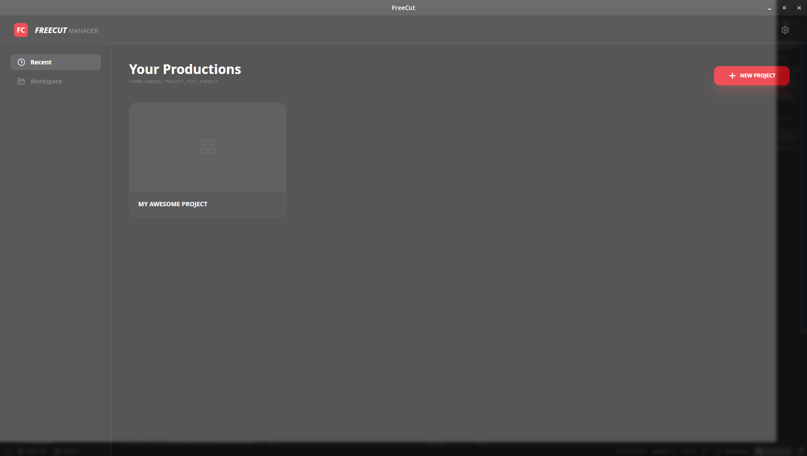
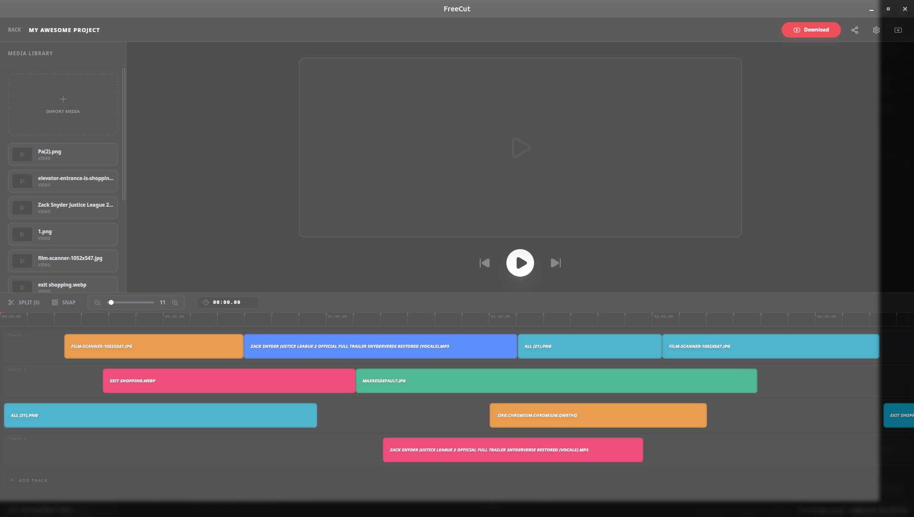

# 🚀 FreeCut - Professional Open Source Video Editor

**FreeCut** is a high-performance, lightweight video editor built for the modern creator. Combining the safety of **Rust** (Tauri) with the flexibility of **React**, it offers a professional-grade timeline experience without the bloat of traditional editors.

**I am trying to creating the Free CapCut available even for Linux and MacOS, more complet than OpenCut, I am accepting recommendations**

> **Status:** 🛠️ _Under Active Development (Alpha)_

----------

## 📸 Project Glimpse

**Project Manager**



**Professional Timeline**




----------

## ✨ Current Features

-   [x] **Smart Project Manager:** Workspace-based file system to organize all your productions.
    
-   [x] **Multi-Track Timeline:** Resizable and vertical-scrolling timeline with dynamic track management.
    
-   [x] **Pro Playback System:** `requestAnimationFrame` driven playhead with sub-second timecode precision.
    
-   [x] **Infinite History (100+ Steps):** Robust Undo/Redo system protecting your creative process.
    
-   [x] **Intelligent Manipulation:**
    
    -   Precision **Split (S)** tool.
        
    -   Multi-select clips and assets for bulk actions.
        
    -   **Smart Snapping:** Magnetic timeline for perfect alignment.
        
-   [x] **Scale Controls:** Dynamic zoom (Ctrl/Alt + Scroll) and resizable UI panels.
    
-   [x] **Asset Purge:** Automatic cleaning of unused tracks to keep the workspace optimized.
    

----------

## 🛠️ Built With

-   **Tauri:** High-performance desktop framework.
    
-   **React + TypeScript:** For a type-safe and reactive UI.
    
-   **Tailwind CSS:** Professional-grade styling.
    
-   **Lucide React:** Beautiful and consistent iconography.
    
-   **Framer Motion:** Smooth transitions and UI feedback.
    

----------

## 🚀 Getting Started

### Prerequisites

-   Node.js (v18+)
    
-   Rust toolchain
    
-   Tauri CLI
    

### Installation

Bash

```
# Clone the repository
git clone https://github.com/seu-usuario/freecut.git

# Install dependencies
npm install

# Run in development mode
npm run tauri dev

```

----------

## 🗺️ Roadmap (Upcoming Features)

-   [ ] **Drag & Drop Trimming:** Resizing clips directly on the timeline edges.
    
-   [ ] **Audio Waveforms:** Visual representation of audio tracks for sync.
    
-   [ ] **Export Engine:** Native rendering via FFmpeg.
    
-   [ ] **Transition Library:** Fade-ins, cuts, and visual effects.
    
-   [ ] **AI-Powered Tools:** Automated subtitles and smart silence cutting.
    

----------

## ⚖️ License

FreeCut is open-source software licensed under the **GNU AGPLv3**.

_Because creative tools should belong to everyone._

